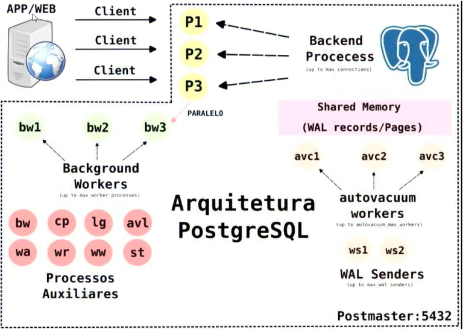

# Process Architecture

- PostgreSQL has a process-based architecture, meaning each connection to the database server is handled by a separate process.
- `pgrep postgres -af` command can be used to list all PostgreSQL processes.
- The main PostgreSQL process is the **Postmaster** (or **PostgreSQL server**), which is responsible for managing database connections and processes. It also allows for the creation of new processes to handle incoming connections.
- The other processes include:
  - **Backend processes**: Handle client connections and execute SQL queries.
  - **WAL writer process**: Writes changes to the Write Ahead Log (WAL).
  - **Checkpointer process**: Periodically writes dirty pages from memory to disk.
  - **Autovacuum process**: Automatically reclaims storage by removing dead tuples.
  - **Background writer process**: Writes dirty pages to disk in the background.
- Each connection to the database server is handled by a separate backend process, which is created by the Postmaster when a new connection is established. It uses CPU and memory resources to execute SQL queries and return results to the client.

  - So, if there are not enough resources available, the server may become slow or unresponsive.

- `WAL`:

  - Write Ahead Log (WAL) is a critical component of PostgreSQL's durability and crash recovery mechanism.
  - It records changes made to the database before they are written to the data files.
  - Ensures that in the event of a crash, the database can be restored to a consistent state.
  - WAL files are stored in a separate directory and can be archived for long-term storage.

- `PostgreSQL Server Process (Postmaster)`:
  - The main process that manages the database server.
  - Responsible for accepting client connections and managing backend processes.
  - Listens for incoming connections on a specified port (default is 5432).
  - Handles configuration settings and manages shared memory.
- `Backend Process (Process)`:

  - Created by the Postmaster when a new client connection is established.
  - Executes SQL queries and returns results to the client.
  - Each backend process has its own memory space and resources.
  - Can be terminated independently of other processes.

- This architecture makes it secure and efficient, as each process can be managed independently.

- `Archiver Process`:
  - Responsible for archiving WAL files to a specified location.
  - Ensures that WAL files are safely stored for point-in-time recovery.
  - Can be configured to use various archiving methods (e.g., file system, cloud storage).
- `WAL Writer Process`:
  - Responsible for writing changes from memory to the WAL.
  - Ensures that changes are durable and can be recovered in case of a crash.
  - Operates in the background and writes changes periodically.
- `WAL Sender Process`:
  - Used in streaming replication to send WAL changes to standby servers.
  - Ensures that standby servers are kept up-to-date with the primary server.
  - Operates in the background and sends changes as they occur.
- `WAL Receiver Process`:
  - Receives WAL changes from the primary server in streaming replication.
  - Applies changes to the standby server to keep it in sync with the primary server.
  - Operates in the background and processes changes as they are received.
- `Background Writer Process`:
  - Responsible for writing dirty pages from memory to disk in the background.
  - Helps reduce the number of dirty pages in memory and improves performance.
  - Operates periodically and writes changes based on certain thresholds.
- `Autovacuum Process`:
  - Automatically reclaims storage by removing dead tuples.
  - Helps maintain database performance and prevents bloat.
  - Operates in the background and runs periodically based on configuration settings.
- `Checkpointer Process`:
  - Periodically writes dirty pages from memory to disk.
  - Ensures that changes are durable and can be recovered in case of a crash.
  - Operates based on certain thresholds and configuration settings.
- `Logger Process`:
  - Responsible for logging messages and errors generated by the PostgreSQL server.
  - Logs messages to a specified log file or system log.
  - Can be configured to log different levels of messages (e.g., errors, warnings, info).
